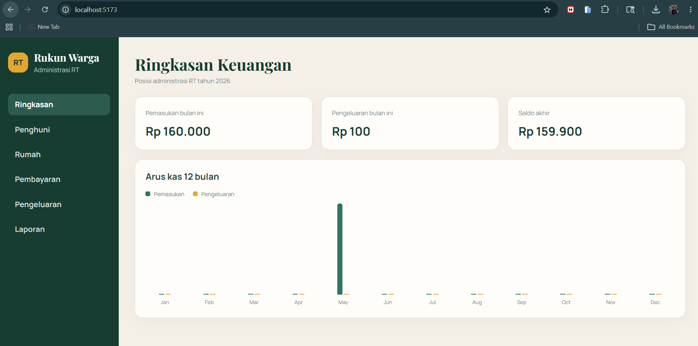
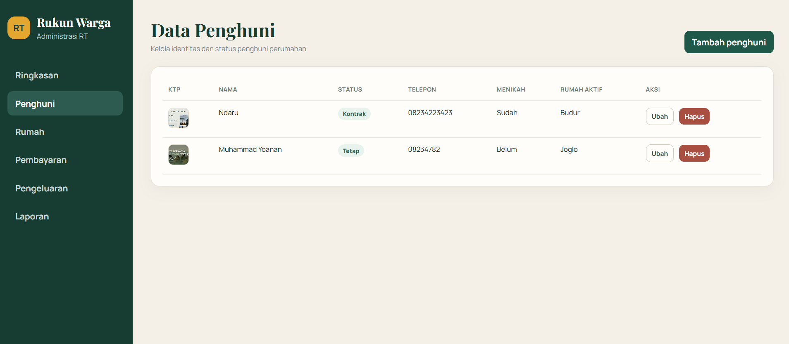
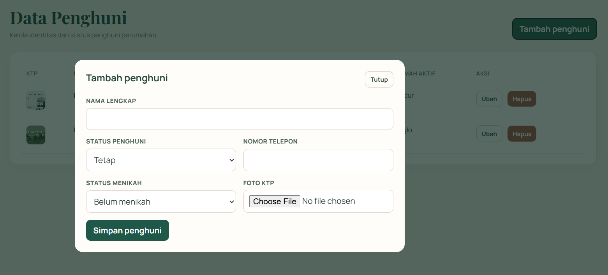
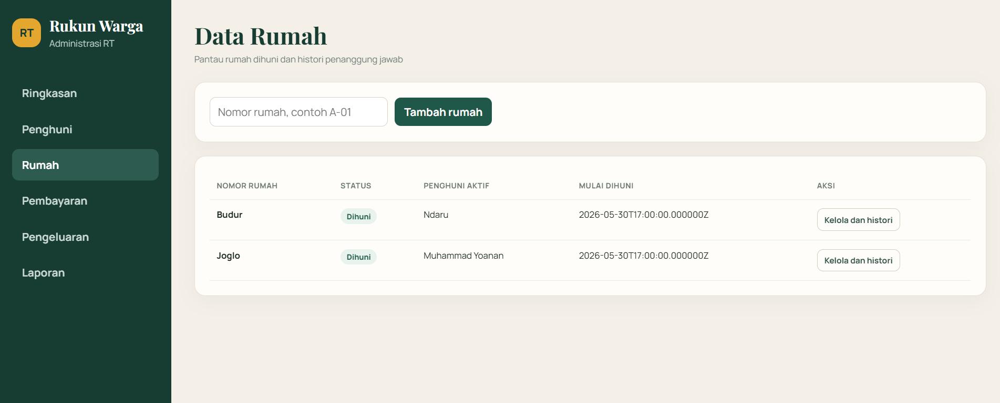
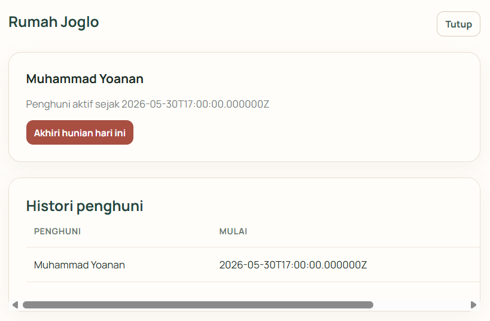
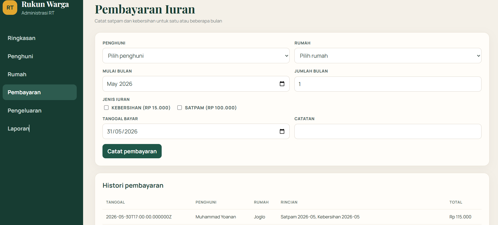
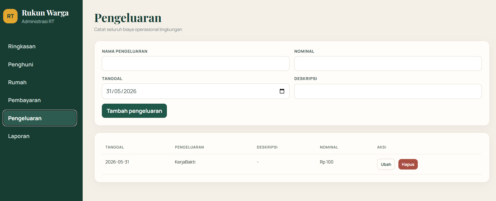
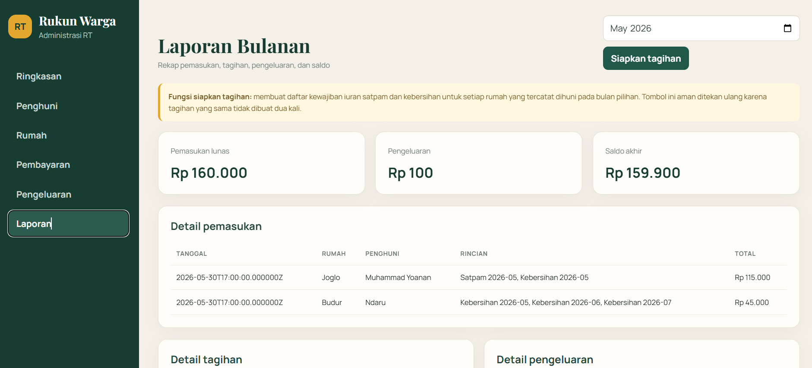
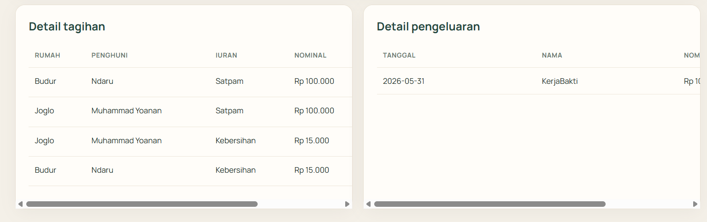

# Ringkasan Fitur Administrasi RT

Dokumen ini merangkum fitur aplikasi berdasarkan screenshot hasil implementasi. Aplikasi membantu pengurus RT mengelola data penghuni dan rumah, mencatat pembayaran iuran, mencatat pengeluaran, serta memantau laporan keuangan bulanan.

## 1. Dashboard Ringkasan Keuangan

Halaman dashboard menampilkan kondisi keuangan RT secara singkat:

- Total pemasukan pada bulan berjalan.
- Total pengeluaran pada bulan berjalan.
- Saldo akhir hasil akumulasi pemasukan dikurangi pengeluaran.
- Grafik arus kas pemasukan dan pengeluaran selama 12 bulan.

Dashboard membantu pengurus RT melihat posisi kas tanpa harus membuka laporan detail.

## 2. Pengelolaan Data Penghuni

Halaman penghuni menampilkan daftar warga beserta informasi utama:

- Foto KTP.
- Nama lengkap.
- Status penghuni tetap atau kontrak.
- Nomor telepon.
- Status menikah.
- Rumah aktif yang sedang ditempati.

Setiap data dapat diubah atau dihapus melalui tombol aksi. Penghuni yang sudah memiliki histori hunian tidak dapat dihapus agar catatan administrasi tetap konsisten.

Tombol `Tambah penghuni` membuka form input identitas warga. Foto KTP wajib diunggah saat menambahkan penghuni baru. File yang diterima adalah JPG, JPEG, PNG, atau WebP dengan ukuran maksimal 2 MB.

## 3. Pengelolaan Data Rumah

Halaman rumah digunakan untuk mencatat nomor rumah serta memantau status hunian. Tabel menampilkan:

- Nomor rumah.
- Status dihuni atau tidak dihuni.
- Nama penghuni aktif.
- Tanggal mulai dihuni.
- Tombol untuk mengelola penghuni dan melihat histori.

Satu rumah hanya dapat memiliki satu penghuni aktif dalam satu periode.

## 4. Histori Penghuni Rumah

Tombol `Kelola dan histori` membuka detail rumah. Halaman ini menampilkan penghuni aktif, tanggal mulai hunian, dan seluruh histori penghuni rumah.

Tombol `Akhiri hunian hari ini` mengakhiri periode penghuni aktif. Setelah periode diakhiri, rumah berubah menjadi tidak dihuni dan dapat diberikan kepada penghuni berikutnya tanpa menghapus histori lama.

## 5. Pembayaran Iuran

Halaman pembayaran digunakan untuk mencatat iuran warga. Pengurus RT dapat memilih:

- Penghuni dan rumah.
- Bulan awal pembayaran.
- Jumlah bulan yang dibayar sekaligus.
- Jenis iuran kebersihan Rp15.000 dan satpam Rp100.000.
- Tanggal pembayaran.
- Catatan tambahan.

Satu transaksi dapat membayar beberapa bulan sekaligus. Setelah pembayaran tersimpan, rincian transaksi muncul pada tabel histori dan tagihan terkait berubah menjadi lunas.

## 6. Pengeluaran Operasional

Halaman pengeluaran mencatat penggunaan kas RT, misalnya kerja bakti, perbaikan fasilitas, atau biaya operasional lain. Data yang dicatat meliputi:

- Nama pengeluaran.
- Nominal.
- Tanggal.
- Deskripsi opsional.

Data pengeluaran dapat ditambahkan, diubah, dan dihapus. Nilainya otomatis diperhitungkan pada dashboard dan laporan bulanan.

## 7. Laporan Bulanan

Halaman laporan menampilkan rekap berdasarkan bulan pilihan:

- Total pemasukan lunas.
- Total pengeluaran.
- Saldo akhir.
- Detail pembayaran yang diterima.

Tombol `Siapkan tagihan` membuat daftar kewajiban iuran satpam dan kebersihan untuk setiap rumah yang tercatat dihuni pada bulan tersebut. Tombol aman ditekan ulang karena sistem tidak membuat tagihan duplikat.

Bagian bawah laporan menampilkan:

- Detail tagihan per rumah, penghuni, jenis iuran, nominal, dan status lunas atau belum lunas.
- Detail pengeluaran pada bulan pilihan.

Pemisahan antara tagihan dan pembayaran membuat pengurus RT dapat melihat kewajiban yang belum dibayar sekaligus arus kas yang benar-benar telah diterima.
